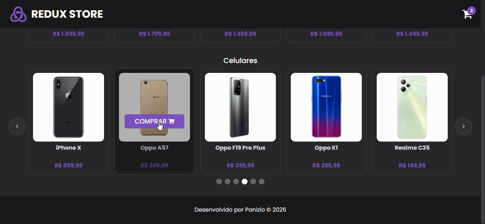
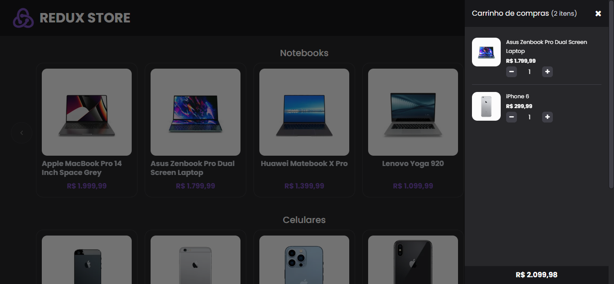

<div>
  
  <h1 align="left">Redux Store</h1>
</div>
<p align="left">  
  Este projeto é uma POC (prova de conceito) de gerenciamento de estados com <a href="https://redux-toolkit.js.org">Redux Toolkit</a>, que simula uma loja com funcionalidades básicas de adição e remoção de produtos no carrinho de compras.
  </p>

<p align="center">
  <a href="#-tecnologias">🛠️ Tecnologias</a>&nbsp;&nbsp;&nbsp;|&nbsp;&nbsp;&nbsp;
  <a href="#-como-executar">⚡ Como Executar</a>&nbsp;&nbsp;&nbsp;|&nbsp;&nbsp;&nbsp;
  <a href="#-licença">📜 Licença</a>
  <br><br>

  
  

</p>
<br>

## 🛠️ Tecnologias

- **Redux Toolkit** + `redux-persist` — estado e persistência do carrinho de compras
- **React Query** + **Axios** — busca de produtos na <a href="https://dummyjson.com">DummyJSON</a>
- **Tailwind CSS** + carousel do <a href="https://ui.shadcn.com/docs/components/base/carousel">shadcn/ui</a> — estilização e slider de produtos
<br><br>

## ⚡ Como executar

Clone este repositório

```bash
git clone https://github.com/lucaspanizio/redux-store.git
```

Acesse o diretório da aplicação

```bash
cd redux-store
```

Faça a instalação das dependências

```bash
npm install
```

Execute a aplicação

```bash
npm run dev
```

Acesse http://localhost:5173 para visualizar a aplicação.
<br><br>


## 📜 Licença

<p>Esse projeto está sob a <a href="https://github.com/lucaspanizio/redux-store/blob/master/LICENSE">licença MIT</a>.<br>

</p>

#### Desenvolvido por José Lucas Panizio 🖖

[](https://www.linkedin.com/in/lucaspanizio/)
[](mailto:lucaspanizio@gmail.com)
